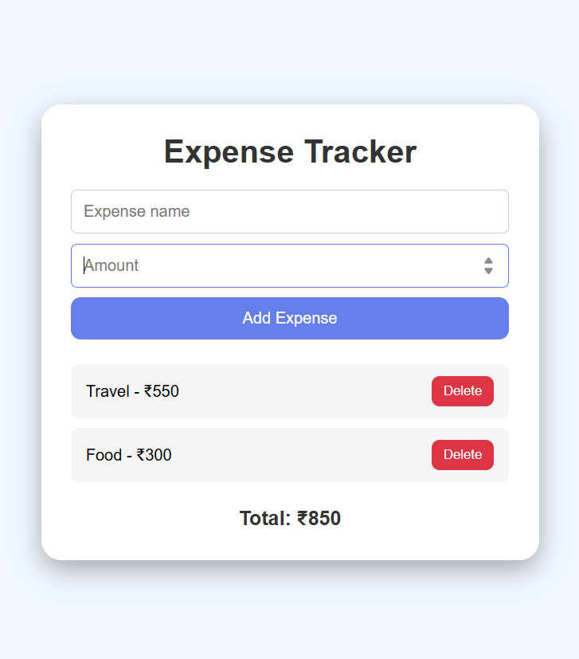

# Expense Tracker

A simple and responsive Expense Tracker application.

## Features

- Add income
- Add expenses

## Technologies Used

- HTML5
- CSS3
- JavaScript

## Project Structure

```
Expense Tracker/
├── expense.html
├── style.css
├── script.js
├── assets/
│   └── screenshot .png
└── README.md
```

## Project Screenshot



## Live Demo

[Live Demo](YOUR-LIVE-DEMO-LINK)

## How to Run

1. Clone or download this repository.
2. Open `expense.html` in your browser.