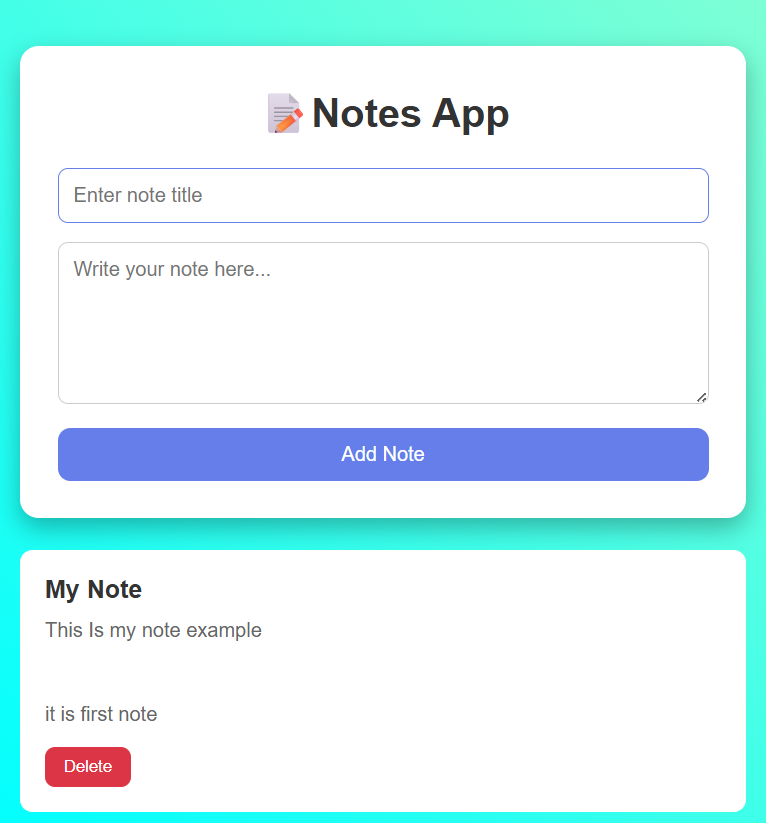

# Notes App

A simple and responsive Notes application built using HTML, CSS, and JavaScript.

## Features

- Add new notes
- Edit notes
- Delete notes
- Save notes using LocalStorage
- Notes remain saved after page refresh

## Technologies Used

- HTML5
- CSS3
- JavaScript
- LocalStorage

## Project Structure

```
Notes App/
├── note.html
├── style.css
├── script.js
├── assets/
│   └── screenshot.png
└── README.md
```

## Project Screenshot



## Live Demo

"Live Demo" (YOUR-LIVE-DEMO-LINK)

## How to Run

1. Clone or download this repository.
2. Open "note.html" in your browser.