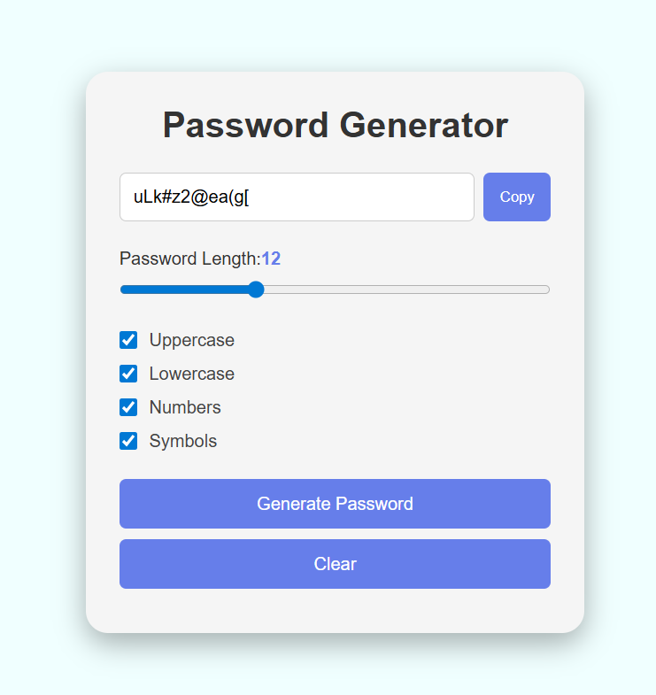

# Password Generator

A simple and responsive Password Generator application built using HTML, CSS, and JavaScript.

## Features

- Generate random passwords
- Choose password length
- Include uppercase letters
- Include lowercase letters
- Include numbers
- Include special characters
- Copy generated password to clipboard

## Technologies Used

- HTML5
- CSS3
- JavaScript

## Project Structure

```
Password Generator/
├── password.html
├── style.css
├── script.js
├── assets/
│   └── screenshot.png
└── README.md
```

## Project Screenshot



## Live Demo

"Live Demo" (YOUR-LIVE-DEMO-LINK)

## How to Run

1. Clone or download this repository.
2. Open "password.html" in your browser.