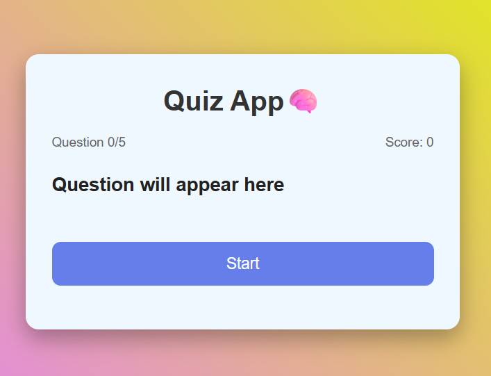
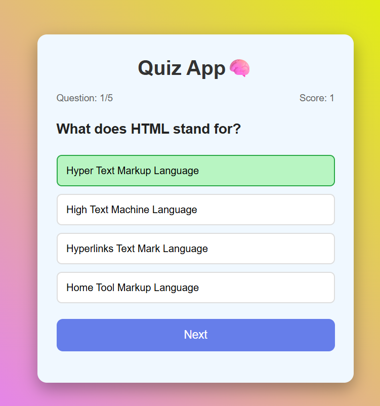
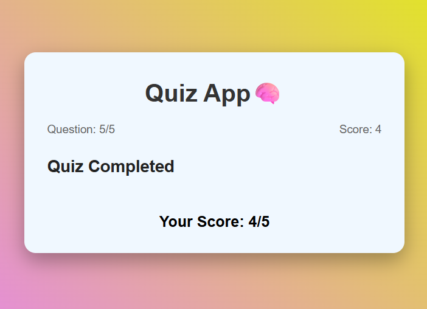

# Quiz App

A simple and responsive Quiz application built using HTML, CSS, and JavaScript.

## Features

- Multiple-choice questions
- Display questions and answer options
- Check answers
- Calculate and display the final score
- Move to the next question
- Restart the quiz

## Technologies Used

- HTML5
- CSS3
- JavaScript

## Project Structure

```
Quiz App/
├── quiz.html
├── style.css
├── script.js
├── assets/
│   └── screenshot.png
└── README.md
```

## Project Screenshot





## Live Demo

"Live Demo" (YOUR-LIVE-DEMO-LINK)

## How to Run

1. Clone or download this repository.
2. Open "quiz.html" in your browser.